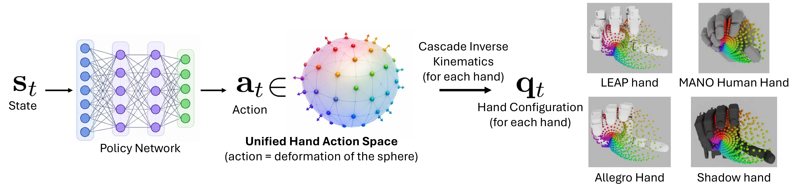
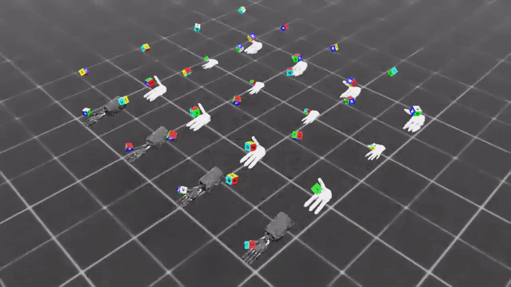
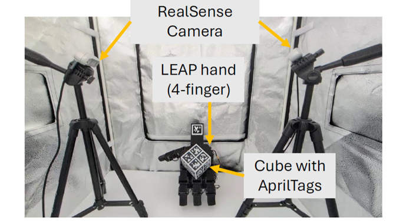
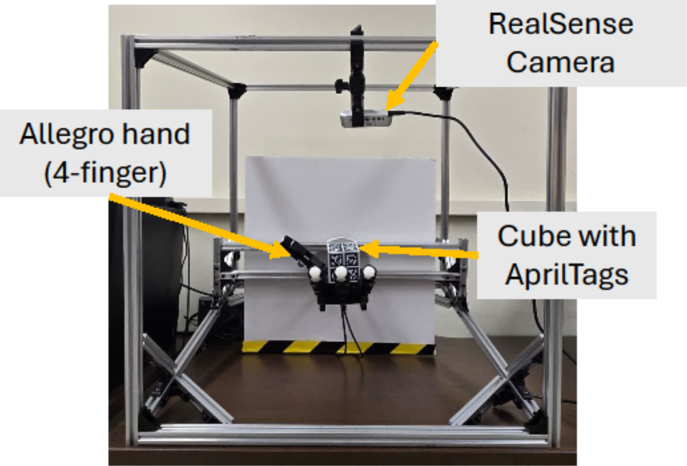

# Unified Hand Action Space for Dexterous In-Hand Manipulation

<div align="center">
  
</div>

**This is the official repository for the paper:**

> **Cross-Embodiment Robot Manipulation via a Unified Hand Action Space**

We present the **Unified Hand Action Space (UHAS)**, a sphere-based geometric action representation that enables a *single* reinforcement learning policy to control **any dexterous robotic hand** — whether it has 4 or 5 fingers and completely different kinematic structures and joint counts.

Instead of learning embodiment-specific joint actions, we represent every hand action as a **deformation of a shared canonical sphere**. A lightweight **Cascade Inverse Kinematics (CIK)** algorithm then maps these sphere deformations back to the exact joint commands of each hand in real time (up to 150 Hz). 

This repository contains:
- The full kinematic analysis and automatic sphere creation pipeline that builds the unified representation from any hand URDF.
- Complete **NVIDIA Isaac Lab** simulation environments for training and evaluating dexterous in-hand cube reorientation policies using UHAS.
- Pre-trained multi-hand models, evaluation scripts, and tools to instantly deploy policies to **new unseen hands**.

---

## Citing our Work

If you use this code, the UHAS representation, or build upon this work, please cite:

**Cross-Embodiment Robot Manipulation via a Unified Hand Action Space**  
Luis Felipe Casas, Robert Teal, Keval Shah, Abhijit Tadepalli, Wanxin Jin, Yu Xiang

[Project Website](https://irvlutd.github.io/UHAS) | [arXiv Paper](https://arxiv.org/abs/PLACEHOLDER) | [Demo Video](https://irvlutd.github.io/UHAS) | [Trained Models](https://github.com/IRVLUTD/UHAS_sim/releases)

```bibtex
@misc{casas2026uhas,
  title={Cross-Embodiment Robot Manipulation via a Unified Hand Action Space},
  author={Casas, Luis Felipe and Teal, Robert and Shah, Keval and Tadepalli, Abhijit and Jin, Wanxin and Xiang, Yu},
  year={2026},
  eprint={PLACEHOLDER},
  archivePrefix={arXiv},
  primaryClass={cs.RO},
  url={https://arxiv.org/abs/PLACEHOLDER}
}
```

---

## License

This project is released under the **Apache License 2.0**.  
See the [LICENSE](LICENSE) file for the full license text.

---

## Table of Contents

- [Unified Hand Action Space for Dexterous In-Hand Manipulation](#unified-hand-action-space-for-dexterous-in-hand-manipulation)
  - [Citing our Work](#citing-our-work)
  - [License](#license)
  - [Table of Contents](#table-of-contents)
  - [Setup the Simulation](#setup-the-simulation)
    - [Requirements](#requirements)
    - [Installation](#installation)
    - [Running the Simulation](#running-the-simulation)
      - [UHAS-Inhand-Repose (Our Method)](#uhas-inhand-repose-our-method)
      - [Single-Hand-Repose (Baseline)](#single-hand-repose-baseline)
  - [Bring Your Own Hand](#bring-your-own-hand)
    - [How to add and test your own hand](#how-to-add-and-test-your-own-hand)
  - [Real World Implementation](#real-world-implementation)
  - [](#)
  - [Helpful Links](#helpful-links)

---

## Setup the Simulation

### Requirements

- **NVIDIA Isaac Sim 4.5.0**
- **Isaac Lab 2.2.1** 
- Python 3.10+
- Anaconda / Miniconda (strongly recommended)
- GPU with sufficient VRAM (≥ 16 GB recommended for 1000+ parallel environments)

### Installation

1. **Clone the repository**
   ```bash
   git clone git@github.com:IRVLUTD/UHAS_sim.git
   cd UHAS_sim
   ```

2. **Install NVIDIA Isaac Sim 4.5.0**  
   Follow the official workstation installation guide:  
   [Isaac Sim Workstation Installation](https://docs.omniverse.nvidia.com/isaacsim/latest/installation/install_workstation.html)

3. **Create and activate the Isaac Lab 2.2.1 conda environment**  
   Follow the official Isaac Lab installation instructions (make sure you check out / install version **2.2.1**):  
   [Isaac Lab Installation Guide](https://isaac-sim.github.io/IsaacLab/main/source/setup/installation/index.html)

   Then activate the environment:
   ```bash
   conda activate isaaclab
   ```

4. **Install the simulation package**
   ```bash
   python -m pip install -e ./sphere_ctrl_isaaclab/source/sphere_ctrl_isaaclab
   ```

### Running the Simulation

All training and evaluation scripts are located in `sphere_ctrl_isaaclab/scripts/rsl_rl/`.

#### UHAS-Inhand-Repose (Our Method)
This is the main environment implementing our **Unified Hand Action Space**. A single policy can be trained across multiple hands (LEAP Hand, Allegro Hand, Shadow Hand, and MANO) simultaneously. It supports:
- Multi-hand joint training
- Zero-shot transfer to unseen hands
- Rapid finetuning
- Homogeneous sphere-based observations and actions

```bash
cd sphere_ctrl_isaaclab/scripts/rsl_rl
python train.py --task UHAS-Inhand-Repose --headless
```

#### Single-Hand-Repose (Baseline)
Direct joint-position control baseline (no UHAS) for comparison against our method.

```bash
cd sphere_ctrl_isaaclab/scripts/rsl_rl
python train.py --task Single-Hand-Repose --headless
```

**For visualization and policy rollout** (remove `--headless` and provide a checkpoint):

```bash
python play.py --task UHAS-Inhand-Repose --checkpoint path/to/model.pt
```


<div align="center">
  
  <p><em>Single-hand policy rollout in the Isaac Lab environment</em></p>
</div>


At this point you can also **test our trained models** directly in simulation. To obtain reliable metrics (Success Rate and Average Consecutive Reorientations), we recommend running evaluation with **1000 parallel environments** — this can be configured in the environment configuration files under `sphere_ctrl_isaaclab/source/sphere_ctrl_isaaclab/tasks/`. You can train or evaluate using any of our supported hands: **LEAP Hand**, **Allegro Hand**, **Shadow Hand**, and **MANO Human Hand**.
For more information about the options available for running the simulations also refer to the `sphere_ctrl_isaaclab/source/sphere_ctrl_isaaclab/sphere_ctrl_isaaclab/tasks` 

---

## Bring Your Own Hand

**Yes — you can use UHAS with your own dexterous hand right away!** 🎉

We include a **multi-hand pre-trained policy** (trained jointly on LEAP + Allegro + Shadow + MANO) inside the `/models` folder. Because the policy operates in the unified sphere action space, it can be deployed **zero-shot** to completely new hand morphologies using our Cascade Inverse Kinematics (CIK) solver.


<div align="center">
  
  <p><em>One policy controlling four different hands simultaneously in simulation</em></p>
</div>


### How to add and test your own hand

1. **Set up Isaac Sim 4.5.0 + Isaac Lab 2.2.1** following the [Setup the Simulation](#setup-the-simulation) guide above.

2. **Convert your hand and generate its UHAS representation**  
   Follow the detailed guide:  
   **[Adding a new Dexterous Hand → `docs/add_hand.md`](docs/add_hand.md)**

   This guide walks you through:
   - Converting your URDF + meshes to Isaac Sim USD format
   - Automatically creating the canonical sphere, surface correspondences, and `sphere_cik.json` file using our kinematic processing tools (the same pipeline used for LEAP, Allegro, Shadow, and MANO)

3. **Deploy the pre-trained multi-hand policy to your new hand**
   ```bash
   cd sphere_ctrl_isaaclab/scripts/rsl_rl
   python play.py --task UHAS-Inhand-Repose \
       --checkpoint ../../models/multi_hand_policy.pt
   ```

The policy will automatically use CIK to translate sphere deformations into valid joint commands for **your** hand — no retraining required!

<div align="center">
  
  <p><em>Zero-shot deployment on the MANO hand (this hand was <strong>never</strong> seen during training)</em></p>
</div>

---

## Real World Implementation

Policies trained entirely in this simulation framework have been successfully deployed to **physical robotic hands** — the LEAP Hand and the Allegro Hand — performing in-hand cube reorientation on real hardware.

For the complete real-world codebase, please visit the companion repository:

**[→ Real-World Deployment Repository](https://github.com/IRVLUTD/UHAS_rw)**

Here are the real-world experimental setups used in our paper:
<table align="center">
  <tr>
    <td align="center">
      
    </td>
    <td align="center">
      
    </td>
  </tr>
  <tr>
    <td colspan="2" align="center">
      <em>Real-world deployments on the LEAP Hand (left) and Allegro Hand (right)</em>
    </td>
  </tr>
</table>
---

## Helpful Links

- [NVIDIA Isaac Sim 4.5.0 Documentation](https://docs.omniverse.nvidia.com/isaacsim/latest/index.html)
- [Isaac Lab 2.2.1 Installation & Documentation](https://isaac-sim.github.io/IsaacLab/main/source/setup/installation/index.html)

---

**Thank you for your interest in our work at the Intelligent Robotics and Vision Lab (IRVL); UT Dallas**

If you have questions, open an issue or reach out via the Lab website. We can't wait to hear your feedback!